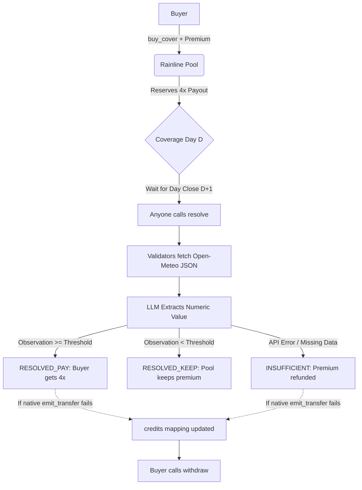

# 🌧️ Rainline 

**Parametric Weather Cover on GenLayer**

Rainline is a deterministic financial primitive built on GenLayer StudioNet. It replaces subjective "AI Courts" and prediction markets with a strict, numeric, and stateless cover mechanism. Buyers lock a premium against a fixed weather template (RAIN, DRY, HEAT). After the coverage day closes, validators extract a single numeric observation from a pinned Open-Meteo historical JSON endpoint. 

No subjective verdicts. No FOR/AGAINST books. No trapped GEN.

### 🌐 Live Links
- **App:** [https://rainline-jet.vercel.app/](https://rainline-jet.vercel.app/)
- **StudioNet Contract:** `0x970dcC20c90F90fc7749f6E10d7AC5a23D6D98C6`
- **Chain ID:** 61999

---

## 🏗️ Architecture & Settlement Flow

Rainline executes deterministically based on public API fetching and consensus.



## 🛡️ The Steward Checklist (Why this design passes)

Previous Intelligent Contract experiments highlighted the need for bulletproof money mechanics and strict objective boundaries. Rainline implements the following architectural strictures:

- **Deterministic Execution (No Subjectivity):** The equivalence principle is strictly bound to numeric extraction (`precipitation_sum` or `temperature_2m_max`). There are no open-ended prose verdicts or party-supplied payout weights.
- **Strict UTC Cutoffs (No Adverse Selection):** `buy_cover` utilizes `gl.message_raw["datetime"]` to enforce that all buys must be finalized 24 hours before the target day 00:00 UTC begins.
- **Pull-over-Push Fallback (No Trapped Funds):** If `emit_transfer` fails on StudioNet (a known EVM quirk with ghost contracts), the contract traps the falsy return and securely routes the exact `amount_wei` to a `credits` mapping for the user to manually `withdraw()`.
- **ID Custody & Retrieval:** An append-only registry is used for listing, but correlation IDs are securely returned directly from the transaction receipt, avoiding read-after-write guessing.
- **No Custody Without Return:** Missing evidence (e.g., API 404, invalid coordinates) correctly triggers the `INSUFFICIENT` state, immediately refunding the buyer's premium.

## 💻 Local Development

1. **Install Dependencies**
   ```bash
   npm install
   ```

2. **Environment Variables (`.env.local`)**
   ```env
   NEXT_PUBLIC_GENLAYER_NETWORK=studionet
   NEXT_PUBLIC_RAINLINE_CONTRACT_ADDRESS=0x970dcC20c90F90fc7749f6E10d7AC5a23D6D98C6
   ```

3. **Run Development Server**
   ```bash
   npm run dev
   ```
   *The app utilizes a same-origin API proxy (`/api/genlayer`) to bypass StudioNet CORS restrictions during local reads.*

## ⚠️ Limits & Honesty (Demo Scope)

- **Not Licensed Insurance:** This is an experimental parametric cover primitive on a testnet.
- **Open-Meteo Model Data:** The free tier of Open-Meteo model data is used as the oracle. Model data is not a physical weather station and is restricted to non-commercial use.
- **Scope Limits:** No flights, no custom policy text editing, and no secondary markets.
