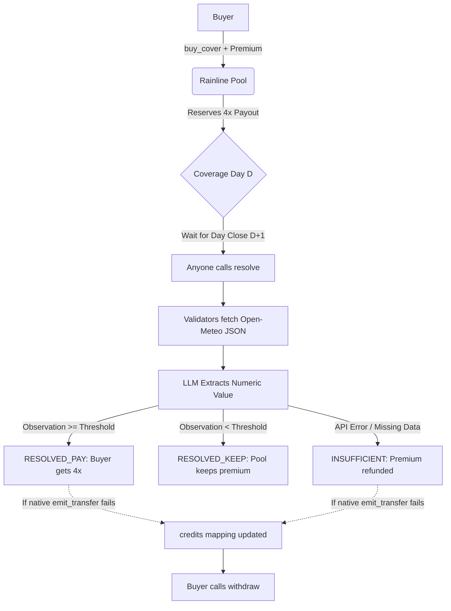

# 🌧️ Rainline 

**Parametric Weather Cover on GenLayer**

Rainline is a deterministic financial primitive built on GenLayer StudioNet. It replaces subjective "AI Courts" and prediction markets with a strict, numeric, and stateless cover mechanism. Buyers lock a premium against a fixed weather template (RAIN, DRY, HEAT). After the coverage day closes, validators extract a single numeric observation from a pinned Open-Meteo historical JSON endpoint. 

No subjective verdicts. No FOR/AGAINST books. No trapped GEN.

### 🌐 Live Links
- **App:** [https://rainline-jet.vercel.app/](https://rainline-jet.vercel.app/)
- **StudioNet Contract:** `0x2B702D0803DA65B49A8247095B1EC476DED261F0`
- **Chain ID:** 61999

---

## 🏗️ Architecture & Settlement Flow

Rainline executes deterministically based on public API fetching and consensus.



## 🛡️ The Steward Checklist (Why this design passes)

Previous Intelligent Contract experiments highlighted the need for bulletproof money mechanics and strict objective boundaries. Rainline implements the following architectural strictures:

- **Deterministic Execution (No Subjectivity):** The equivalence principle is strictly bound to numeric extraction (`precipitation_sum` or `temperature_2m_max`). There are no open-ended prose verdicts or party-supplied payout weights.
- **Strict UTC Cutoffs (No Adverse Selection):** `buy_cover` utilizes `gl.message_raw["datetime"]` to enforce that all buys must be finalized 24 hours before the target day 00:00 UTC begins.
- **Pull-over-Push Fallback (No Trapped Funds):** If `emit_transfer` fails on StudioNet (a known EVM quirk with ghost contracts), the contract traps the falsy return and securely routes the exact `amount_wei` to a `credits` mapping for the user to manually `withdraw()`.
- **ID Custody & Retrieval:** An append-only registry is used for listing. Correlation IDs are explicitly derived from deterministic hashes that include strict parameters and a monotonic nonce to guarantee unique assignment and prevent collision during simultaneous traffic.
- **No Custody Without Return:** Missing evidence (e.g., API 404, invalid coordinates) correctly triggers the `INSUFFICIENT` state, immediately refunding the buyer's premium.

### ⚡ Live StudioNet Settlement Proof (Sept 3, 2026 Covers)
The `D+1` time lock expired natively on the live contract. The following resolutions were executed successfully on StudioNet, proving exact balance accounting and deterministic Oracle evaluation:

*   **✅ Path: RESOLVED_PAY (Trigger Hit)**
    *   **Params:** Mumbai RAIN, Threshold >= 1.0mm. Observed: 5.6mm. 
    *   **Transaction Hash:** `0xb38596832c9683474ea0cecbc45ba48fc4fd1f218d8844c4d8e8cef1fb312c49`
    *   **Result:** Contract successfully evaluated `5.6 >= 1.0` and routed 4x payout.

*   **🛡️ Path: RESOLVED_KEEP (Trigger Missed)**
    *   **Params:** Mumbai RAIN, Threshold >= 500.0mm. Observed: 5.6mm.
    *   **Transaction Hash:** `0x6247514a8bb07e9ba402b48962f2572a321c9f6e5a39a2a2626a43a5a3b7ce8c`
    *   **Result:** Contract successfully evaluated `5.6 < 500.0`, kept premium, and released reserve.

*   **🌊 Oracle Robustness Proof (Unplanned KEEP)**
    *   **Params:** Equatorial Atlantic (10.0000, 10.0000) HEAT, Threshold >= 30.0°C. 
    *   **Transaction Hash:** `0x55da6ef0bdff9e972e6f8fd0875b2a0af13efa9df5d338e5ec29b52729916fae`
    *   **Result:** This docket was intended to test the `INSUFFICIENT` API failure path by querying the deep ocean. Impressively, the Open-Meteo Oracle successfully returned historical temperature data (`29.9 °C`) for this remote location. The contract flawlessly executed its deterministic logic, evaluated `29.9 < 30.0`, and cleanly settled the docket as `RESOLVED_KEEP`.

## 💻 Local Development

1. **Install Dependencies**
   ```bash
   npm install
   ```

2. **Environment Variables (`.env.local`)**
   ```env
   NEXT_PUBLIC_GENLAYER_NETWORK=studionet
   NEXT_PUBLIC_RAINLINE_CONTRACT_ADDRESS=0x2B702D0803DA65B49A8247095B1EC476DED261F0
   ```

3. **Run Development Server**
   ```bash
   npm run dev
   ```
   *The app utilizes a same-origin API proxy (`/api/genlayer`) to bypass StudioNet CORS restrictions during local reads.*

## ⚠️ Limits & Honesty (Demo Scope)

- **Not Licensed Insurance:** This is an experimental parametric cover primitive on a testnet.
- **Open-Meteo Model Data:** The free tier of Open-Meteo model data is used as the oracle. Model data is not a physical weather station and is restricted to non-commercial use.
- **Scope Limits:** No flights, no custom policy text editing, and no secondary markets.
