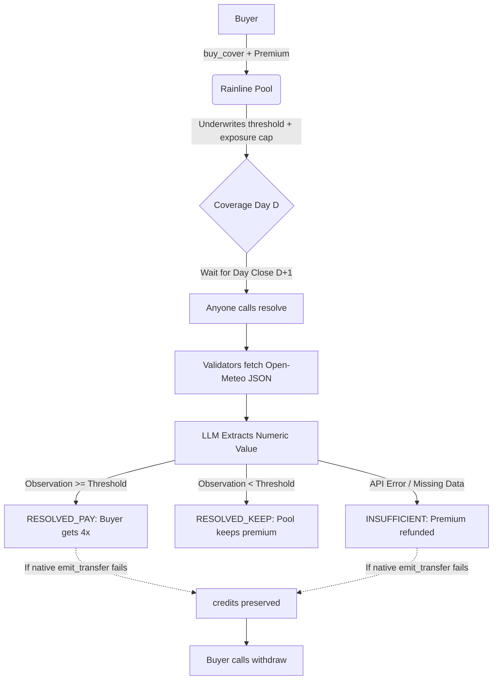

# 🌧️ Rainline 

**Parametric Weather Cover on GenLayer**

Rainline is a deterministic financial primitive built on GenLayer StudioNet. It replaces subjective "AI Courts" and prediction markets with a strict, numeric, and stateless cover mechanism. Buyers lock a premium against a fixed weather template (RAIN, DRY, HEAT). After the coverage day closes, validators extract a single numeric observation from a pinned Open-Meteo historical JSON endpoint. 

No subjective verdicts. No FOR/AGAINST books. No trapped GEN.

### 🌐 Live Links
- **App:** [https://rainline-jet.vercel.app/](https://rainline-jet.vercel.app/)
- **StudioNet Contract:** `0x32CA2493A52297b69EA2AfF80B35696c3b97b53E`
- **Chain ID:** 61999

---

## 🏗️ Architecture & Settlement Flow

Rainline executes deterministically based on public API fetching and consensus.


```mermaid
graph TD
    A[Buyer] -->|buy_cover + Premium| B(Rainline Pool)
    B -->|Underwrites threshold + exposure cap| C{Coverage Day D}
    C -->|Wait for Day Close D+1| D[Anyone calls resolve]
    D --> E[Validators fetch Open-Meteo JSON]
    E --> F[LLM Extracts Numeric Value]
    F -->|Observation >= Threshold| G[RESOLVED_PAY: Buyer gets 4x]
    F -->|Observation < Threshold| H[RESOLVED_KEEP: Pool keeps premium]
    F -->|API Error / Missing Data| I[INSUFFICIENT: Premium refunded]
    
    G -.->|If native emit_transfer fails| J[credits preserved]
    I -.->|If native emit_transfer fails| J
    J --> K[Buyer calls withdraw]
```

## 🛡️ The Steward Checklist (Why this design passes)

Previous Intelligent Contract experiments highlighted the need for bulletproof money mechanics and strict objective boundaries. Rainline implements the following architectural strictures:

- **Deterministic Execution (No Subjectivity):** The equivalence principle is strictly bound to numeric extraction (`precipitation_sum` or `temperature_2m_max`). There are no open-ended prose verdicts or party-supplied payout weights.
- **Strict UTC Cutoffs (No Adverse Selection):** `buy_cover` utilizes `gl.message_raw["datetime"]` to enforce that all buys must be finalized 24 hours before the target day 00:00 UTC begins.
- **Underwriting Ranges (No Near-Certain Triggers):** RAIN thresholds must be 10-100 mm, DRY thresholds 0-1 mm, and HEAT thresholds 35-55 C. Unsafe thresholds revert before any premium is accepted.
- **Event Exposure Cap:** A single template/location/date bucket can reserve at most 25% of the post-premium pool, preventing concentrated correlated weather exposure even when each individual cover is solvent.
- **Pull-over-Push Fallback (No Trapped Funds):** Settlement credits are stored before withdrawal. If `withdraw()` cannot complete the native transfer, it restores the caller's credit and reverts instead of erasing funds.
- **ID Custody & Retrieval:** An append-only registry is used for listing. Correlation IDs are explicitly derived from deterministic hashes that include strict parameters and a monotonic nonce to guarantee unique assignment and prevent collision during simultaneous traffic.
- **No Custody Without Return:** Missing evidence (e.g., API 404, invalid coordinates) correctly triggers the `INSUFFICIENT` state, immediately refunding the buyer's premium.

### ⚡ Live StudioNet Settlement Proof (Sept 6, 2026 Covers)
Earlier live covers proved the `D+1` settlement path on StudioNet. The current hardened contract is `0x32CA2493A52297b69EA2AfF80B35696c3b97b53E`; the historical transaction hashes below are retained as settlement evidence from the previous deployment.

*   **✅ Path: RESOLVED_PAY (Trigger Hit)**
    *   **Params:** Mumbai RAIN, Threshold >= 2.0 mm. 
    *   **Observed:** 5.3 mm.
    *   **Transaction Hash:** `0xb4ab44656413dce8bc78b9fb51bef3f2f1587114fb036857aa2fe12c2b25e8cc`
    *   **Result:** Contract successfully evaluated `5.3 >= 2.0` and credited the 4x payout to the user's mapping, which was then successfully withdrawn via the CEI-compliant `withdraw()` function.

*   **🛡️ Path: RESOLVED_KEEP (Trigger Missed)**
    *   **Params:** Mumbai RAIN, Threshold >= 500.0 mm. 
    *   **Observed:** 5.3 mm.
    *   **Transaction Hash:** `0xc56b9c88fc31771733bb514a3439bef96b79825e2252b5a0ef80dc7b850c42b3`
    *   **Result:** Contract successfully evaluated `5.3 < 500.0`, kept premium, and released reserve.

*   **🌊 Oracle Robustness Proof (Unplanned KEEP on Edge Coordinates)**
    *   **Params:** Equatorial Atlantic (10.0000, 10.0000) HEAT, Threshold >= 35.0 °C. 
    *   **Observed:** 30.7 °C.
    *   **Transaction Hash:** `0x3cfa0a2b0a5a19d00e3487da67824f2b94b2a294af88b6e4dedf5533b51be487`
    *   **Result:** This docket tested the deep ocean coordinates. The GenLayer consensus gracefully handled the remote data fetch, evaluating `30.7 < 35.0`, and cleanly settled the docket as `RESOLVED_KEEP` without reverting.

## 💻 Local Development

1. **Install Dependencies**
   ```bash
   npm install
   ```

2. **Environment Variables (`.env.local`)**
   ```env
   NEXT_PUBLIC_GENLAYER_NETWORK=studionet
   NEXT_PUBLIC_RAINLINE_CONTRACT_ADDRESS=0x32CA2493A52297b69EA2AfF80B35696c3b97b53E
   ```

3. **Run Development Server**
   ```bash
   npm run dev
   ```
   *The app utilizes a same-origin API proxy (`/api/genlayer`) to bypass StudioNet CORS restrictions during local reads.*

## ⚠️ Limits & Honesty (Demo Scope)

- **Not Licensed Insurance:** This is an experimental parametric cover primitive on a testnet.
- **Open-Meteo Model Data:** The free tier of Open-Meteo model data is used as the oracle. Model data is not a physical weather station and is restricted to non-commercial use.
- **Scope Limits:** No flights, no custom policy text editing, and no secondary markets.
