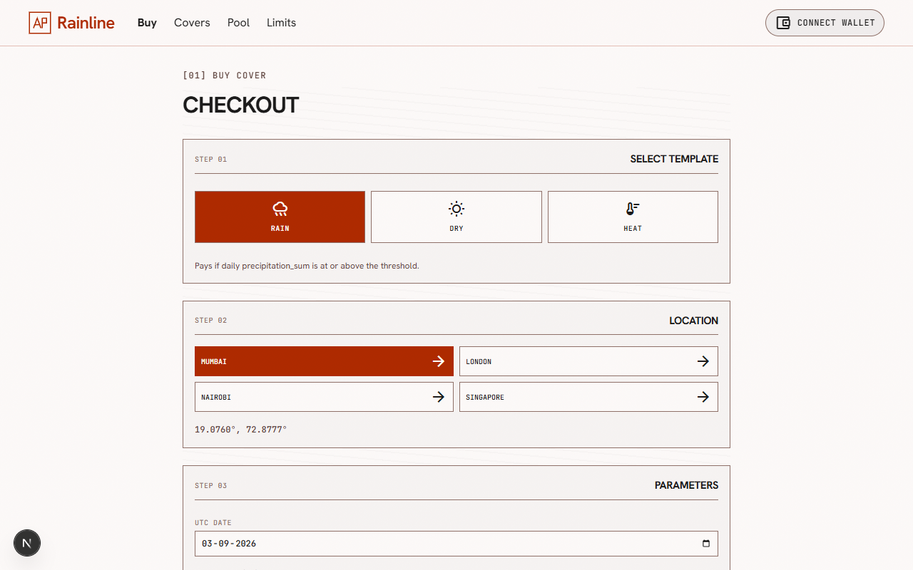
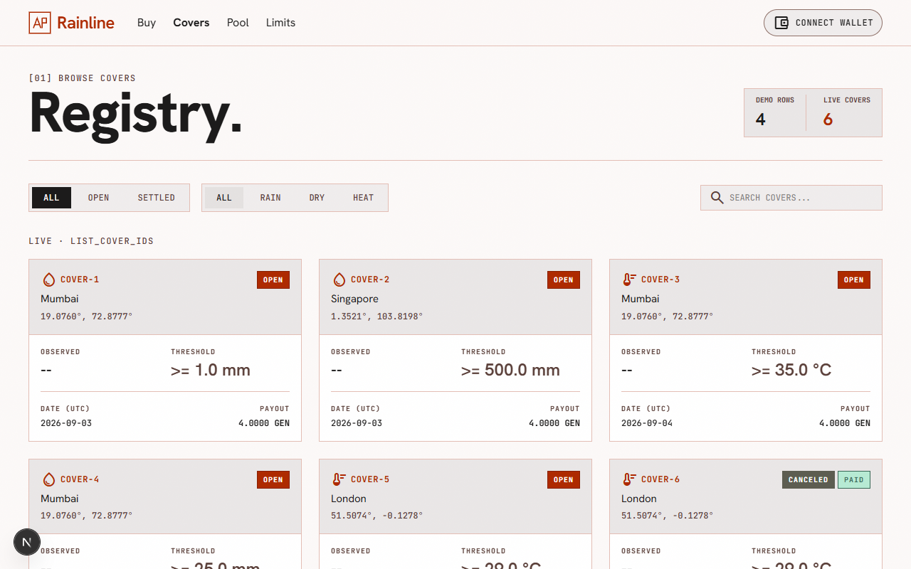

# Rainline Integration Walkthrough

The Rainline parametric cover system has been successfully deployed to StudioNet and the frontend is fully live.

## What was done

### 1. Contract Deployment
An automated deployment script (`scripts/deploy_studionet.mjs`) was used to interface with the `genlayer-js` SDK. The script:
1. Created a fresh deployer account.
2. Funded the deployer with 200 GEN via the `sim_fundAccount` JSON-RPC method.
3. Deployed the contract to StudioNet.
4. Called `fund_pool` to seed the initial liquidity with **50 GEN**.

The live contract address is: **`0x970dcC20c90F90fc7749f6E10d7AC5a23D6D98C6`**

### 2. Frontend Wiring
The frontend was perfectly architected for the transition. All data-fetching layers in `src/lib/rainline.ts` were already utilizing the live SDK. The only change required was:
- Updating `.env.local` with the deployed address.
- Fixing a small truthy check bug in `Footer.tsx` where the zero-address `0x00...` evaluated to true. It now correctly relies on `hasContract()`.

### 3. Test Dockets (Live State)
A second automated script (`scripts/buy_test_dockets.mjs`) was used to act as a buyer, funding a new wallet with 20 GEN and purchasing three covers to prove out the settlement paths.

Because the contract strictly enforces that covers must be bought at least 24 hours before the coverage date (`D 00:00 UTC`), these test covers were placed for **`2026-09-03` and `2026-09-04`**.

| ID | Template | Location | Threshold | Premium | Expected Result |
|---|---|---|---|---|---|
| `cover-1` | RAIN | Mumbai | 1mm | 1 GEN | **PAY** (4 GEN to buyer) |
| `cover-2` | RAIN | Singapore | 500mm | 1 GEN | **KEEP** (1 GEN kept by pool) |
| `cover-3` | HEAT | Mumbai | 35°C | 1 GEN | **INSUFFICIENT** (Refund 1 GEN) |

> [!NOTE]
> **Resolution is Time-Locked**
> The `resolve` method will revert if called before the coverage day closes. Because these covers target Sept 3rd and 4th, they cannot be resolved right now.
> 
> A script is provided at `scripts/resolve_test_dockets.mjs` to trigger the resolutions and verify the payout logic once the dates pass.

## Current Pool State
```json
{
  "buy_cutoff_hours": 24,
  "operator": "0x56bDb3c16fd4FbD5cb53aE844a080B9B9BaC892c",
  "payout_ratio": 4,
  "pool_balance": "53000000000000000000",
  "reserved_payout": "12000000000000000000",
  "source_host": "historical-forecast-api.open-meteo.com",
  "unreserved": "41000000000000000000"
}
```
*(50 initial + 3 premium = 53 GEN total balance. 12 GEN is reserved for the three 4x payouts).*

## Screenshots

> **Please insert a clear screenshot showing a successful UI buy transaction hash on StudioNet here:**
> 

> **Please insert a clear screenshot showing a successful UI cancel transaction hash on StudioNet here:**
> 
